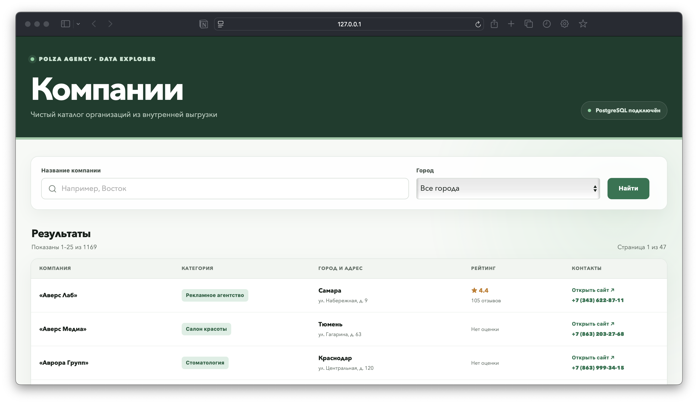
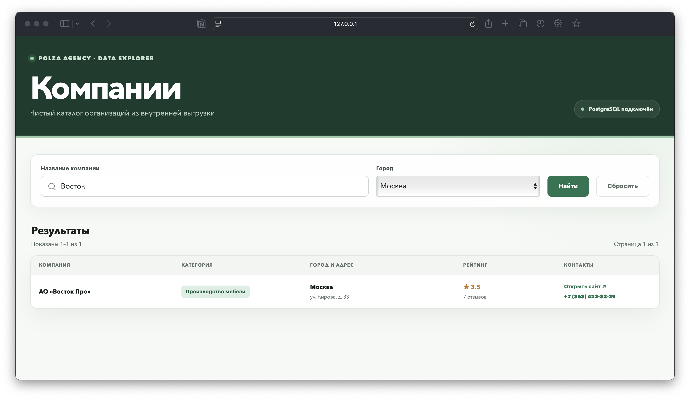

# Polza Agency — техническое задание

Решение задач 1–3: импорт JSON/CSV в PostgreSQL и серверная страница `/companies` на Next.js App Router.

## Запуск

Требования: Node.js 20.9+, Docker и Docker Compose.

```bash
cp .env.example .env
npm ci
npm run setup
npm run dev
```

Страница будет доступна по адресу `http://localhost:3000/companies`.

Команда `setup` поднимает PostgreSQL 17, применяет `schema.sql`, импортирует JSON и CSV, затем проверяет итоговые количества. Шаги можно запускать отдельно:

```bash
npm run db:up
npm run db:schema
npm run import:pages
npm run import:review
npm run db:verify
```

Три запроса из задания находятся в `queries.sql`:

```bash
docker-compose exec -T db psql -U polza -d polza --file=/dev/stdin < queries.sql
```

## Результат импорта

| Источник | Получено | Принято | Дубли | Отклонено |
|---|---:|---:|---:|---:|
| `page_*.json` | 1000 | 994 | 6 | 0 |
| `review.csv` | 207 | 187 | 3 | 17 |

В `companies` загружено 1169 уникальных компаний. В `company_source_records` сохранён 1181 внешний идентификатор: несколько идентификаторов могут ссылаться на одну компанию. Невалидные строки CSV вместе с payload и причинами находятся в `import_rejections`.

## Решения по базе и импорту

- Внутренний PK компании не зависит от ID источника.
- `identity_key` строится из нормализованных названия, города и адреса; регистр, пробелы, кавычки, пунктуация и `ё/е` не создают новый бизнес.
- Внешние ID и исходный payload вынесены в `company_source_records`.
- Импорт выполняется bulk-операциями через `jsonb_to_recordset`, одной транзакцией на batch и с `ON CONFLICT`.
- Ошибка откатывает batch целиком; повторный запуск идемпотентен.
- Инварианты продублированы в PostgreSQL через `NOT NULL`, `CHECK`, `UNIQUE` и FK.
- Для поиска по названию создан GIN `pg_trgm`; для города, категории и внешних связей — B-tree индексы.

`/companies` получает данные в Server Component. На запрос страницы выполняются один параметризованный SQL-запрос списка с пагинацией и `COUNT(*) OVER()` и один запрос справочника городов. N+1 нет, `DATABASE_URL` не попадает в клиентский код, wildcard-символы поиска экранируются.

На текущем объёме используется offset pagination. Для миллионов строк следующий шаг — keyset pagination и отдельный кэшированный либо приблизительный total.

Подробный разбор исходных данных находится в `ANOMALIES.md`. Email отсутствует и в JSON, и в CSV, несмотря на упоминание email в критериях; решение не выдумывает отсутствующие данные.

## Проверки

```bash
npm run lint
npm run typecheck
npm test
npm run build
npm audit --omit=dev
```

CI дополнительно поднимает PostgreSQL 17, применяет схему, выполняет оба импорта и проверяет данные скриптом `db:verify`.

## Как проверял

Поднял чистый PostgreSQL в Docker, применил схему и прогнал обе выгрузки, затем сверил количества в основных, source- и rejection-таблицах. В production-сборке проверил общий список, пагинацию, поиск `Восток` вместе с городом `Москва`, сброс фильтров и пустую выдачу. На первом интеграционном прогоне PostgreSQL отклонил корректные телефоны: `\d` в CHECK работал не так, как JavaScript regex, поэтому заменил его на POSIX-совместимый `[0-9]` и повторил импорт. После исправления проверил health endpoint, три SQL-запроса, production Docker image и два скриншота страницы в Safari.

## Скриншоты




